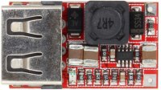

# DC-DC Step Down Module 6-24V 12V 24V to 5V 3A Power Supply Charger QS-1205CBUL-3A

 - Brand: QSKJ
 - Model: [QS-1205CBUL-3A](https://www.qskj.cc/shop/dc-dc-step-down-module-6-24v-12v-24v-to-5v-3a-power-supply-charger-qs-1205cbul-3a-6687)
 
## Images.

 - [QS-1205CBUL-3A_top.jpg](QS-1205CBUL-3A_top.jpg)
 - [QS-1205CBUL-3A_front.jpg](QS-1205CBUL-3A_front.jpg)
 - [QS-1205CBUL-3A_bottom.jpg](QS-1205CBUL-3A_bottom.jpg)

## Features:

 - High quality USB port.
 - Output voltage indicator (RED).
 - The max output current 3A, long time use 2.1A, enough use.
 - New design, 3 solid state ceramic capacitors (MLCC).
 - Synchronous rectification, High efficiency, 6.5V to 5V 0.7A can up to 97.5%, 12V to 5V 1A can up to 94%.
 - Flat copper inductor, improve conversion efficiency
 - With output overvoltage protection. There is 1.5A fuse, output 5V have 300W TVS tube protect your USB device.
 - Using the latest USB identification circuit, perfectly compatible with IPHONE, the most of Android phones, IPAD etc.
 - Input with reverse polarity protection diode, will not damage when input connect incorrect.

## Parameters:

 - Input voltage: DC 6-24V
 - Output voltage: 5.1-5.2V
 - Output current: 3A MAX 
 - Switch frequency:  500KHz
 - Size：26.4(L)*15(W)*7.4(H)  mm
 - Output ripple: 10mV around (12V to 5V3A) 20M bandwidth
 - Output indicator: Output voltage indicator is red
 - Full load temperature: 30 Celsuis
 - Static current: 0.85 mA
 - Load regulation:  ± 1%
 - Voltage Regulation:  ± 0.5%
 - Dynamic response speed:  5% 200uS
 - Connection mode:  Welding
 - Input mode:  Welding
 - Output mode: US
 - Output overvoltage protection: Yes, input 1.5A fuse, output 5V have 300W TVS tube clamp protection.
 - Output short circuit protection: Yes, but please do not short circuit for a long time
 - Input reverse polarity protection: Yes, there is reverse polarity protection diode
 - Module Properties:  non-isolated buck module (BUCK) synchronous rectification
 - Conversion efficiency:  can up to 97.5% (6.5V step down to 5V 0.7A) (after short reverse protection and fuses test value)
 - Ultra-low static current, 0.85 mA only. Do not need to add swith when connected to the car battery, can be connected to car cigarette lighter cable or ACC power supply cable.
 - Operating temperature: Industrial grade (-40 Celsuis to + 85 Celsuis) (the higher the ambient temperature, the lower the output power)