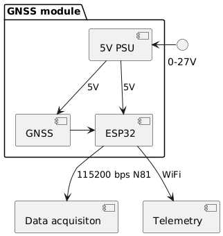

# PLantUML code for component diagram HWComponentDiagram.png



```
@startuml

package "GNSS module" {
  [5V PSU]
  [GNSS]
  [ESP32]
}

[GNSS] -right-> [ESP32]
[ESP32] --> [Data acquisiton] : 115200 bps N81
[ESP32] --> [Telemetry] : WiFi
[5V PSU] --> [ESP32] : 5V
[5V PSU] --> [GNSS] : 5V

"0-27V" -right-> [5V PSU]

@enduml
```
