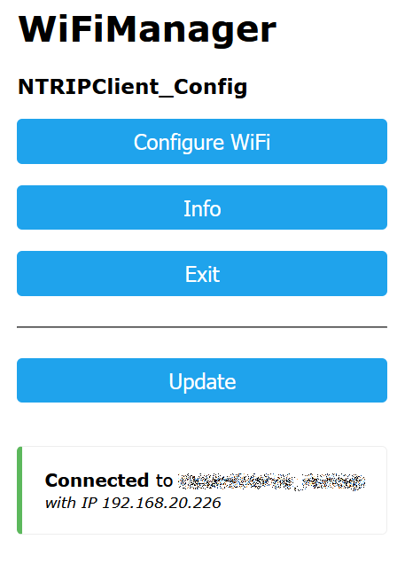
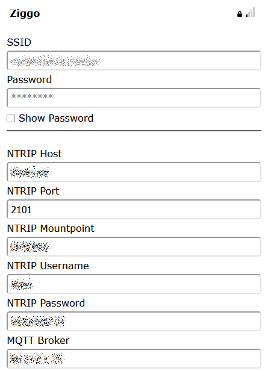
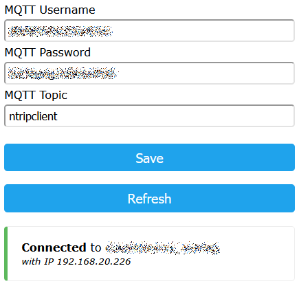
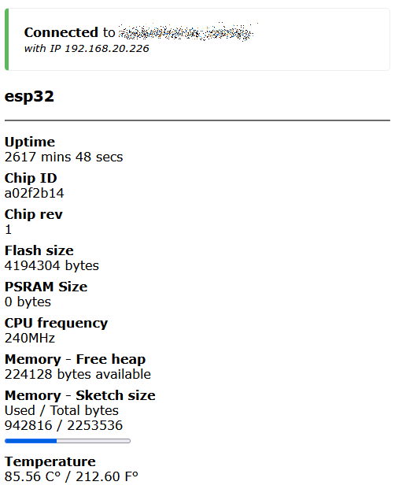
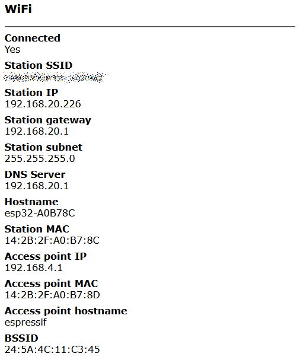
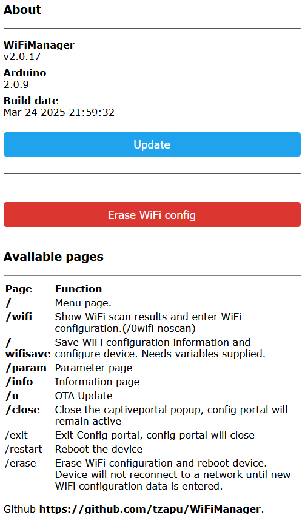
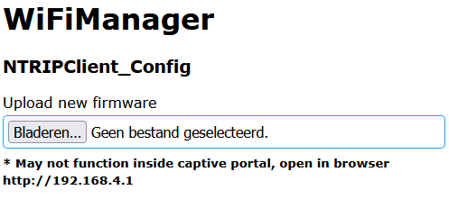

# Software manual NTRIP Client

The NTRIP client is developed for the [Hydromotive project](https://www.hydromotive.nl/) to enable cm precison location and timing. 

The **NTRIP client** (Networked Transport of RTCM via Internet Protocol) is used to receive real-time correction data for a **GNSS (Global Navigation Satellite System)** receiving. By connecting to an **NTRIP caster** (a server that distributes correction data from an NTRIP base station or network) the NTRIP data is received and forwarded to the connected GNSS receiver.

The position and timing information from the GNSS receiver is published using the **MQTT (Message Queuing Telemetry Transport)** protocol on a **MQTT broker** for post processing purposes and live monitoring. 

### **How this NTRIP client Works:**
1. The **GNSS receiver** connects to an **NTRIP client**.
2. The **NTRIP client** sends a request to an **NTRIP caster** over the internet.
3. The **NTRIP caster** provides **RTCM correction data** from a nearby base station or network.
4. The **GNSS receiver** uses this data to correct its position in real time.
5. The **MQTT client** connects to an **MQTT broker** (server).
6. The **MQTT client** **subscribes** to a topic (e.g., "ntripclient").
7. The **MQTT client** publishes position and timing data to the topic
8. The broker **forwards** messages to all subscribed clients that use the data.
9. The **MQTT client** publishes time data to the data ackuisition unit of the Hydromotive vehicle. 

# NTRIP Client operation.
After powering the NTRIP Client, WiFi connection is initiated. At a successfull WiFi connection, the NTRIP caster is connected and the mountpoint table is requested. When the mointpoint table is received, the mointpoint is connected and RTCM data that is received will be forwarded to the GNSS receiver. When a valid set of NMEA sentences is received from the GNSS receiver, a aggregate of time, postion and accuracy data is send to the MQTT broker. 

### WiFi Connection failure
When the **Wifi connection fails at startup**, a WiFi accesspoint and the configuration portal is activated. The configuration panel can be accesses after connecting to the Accesspoint and ip-address 192.168.4.1.

When the **WiFi connection fails during operation**, reconnects are attempted. After a period of time, a WiFi accesspoint and the configuration portal is activated for configuration. 

### Connection failure with NTRIP caster 
When the **Connection fails with the NTRIP caster**, a restart of the NTRIP Client is executed to attempt to recover the connection.

### Connection failure with MQTT broker
When the **Connection fails with the MQTT broker**, an attempt is made to reconnect. Because NTRIP correction data for the GNSS receiver has priority over MQTT, the ocnnection NTRIP is retained and the NTRIP Client will not restart. 

### NTRIP Client Configuration
> The NTRIP Client can be configured from Platform.io by writing the config file `config.json` in de `data` directory to SPIFFS. Instructions can be found in `data_template/readme.md`.

The NTRIP Client can be configured using WiFi manager: 
 - During normal operation, WiFi manager can be activated by **pressing the config-button longer than 3 seconds**. 
 - When WiFi the connection fails, an Accesspoint is activated where the WiFi manager can be accessed. 

# WiFi manager

WiFi Manager manages al configureable items of the NTRIP Client in a browser. The WiFi manager is invoked after a connect failure of the WiFi at boot, or after pressing the **Configuration button** for a period longer than 3 seconds. 

In the following paragraphs the menus of WiFi manager are discussed.

## Main menu

Main memu is the start screen when entering WiFi manager.

*Figure 1: Main menu of WiFimanager for NTRIP Client.*

The main menu allows access to the following screens: 
 1. **Configure WiFi**: Configure NTRIP Client settings. 
 2. **Info**: System information. 
 3. **Exit**: Store settings and reboot NTRIP client. 
 4. **Update**: Update software image.
 
## Configure NTRIP Client settings

WiFi manager allows for full configuration of the NTRIP Client. The following parameters can be configured using Wifi manager: 

 - WiFi:
   - **ssid**: SSID of the WiFi Accesspoint
   - **password**: Password for the WiFi Accesspoint
 - NTRIP Client:
   - **host**: hostname of the NTRIP Caster
   - **tcp-port**: tcp-port for the broker *(Default: 2101)*
   - **mntpnt**: mountpoint
   - **username**: username for the NTRIP caster
   - **password**: password for the user
 - MQTT Client:
   - **broker**: *IP-address* of the MQTT broker **(No URL!)**
   - **port**: tcp-port for the broker *(Default: 1883)*
   - **topic**: Topic where the data will be published *(e.g. ntripclient)*
   - **username**: username for the MQTT broker
   - **password**: password for the user

The configuration items are permanently stored on the NTRIP Client. 

*Figure 2: Settings menu of WiFi manager for NTRIP Client.*

## Info

WiFi manager shows system information of the NTRIP Client: 

*Figure 3: Information menu of WiFi manager for NTRIP Client.*

## Exit

To close WiFo manager, click **Exit** to save teh settings and restart NTRIP Client. 

## Update

In the Update menu the firmware of the NTRIP Client can be updated. 
> **This feature is not tested. Use with care!**

*Figure 4: Update menu of WiFi manager for NTRIP Client.*
